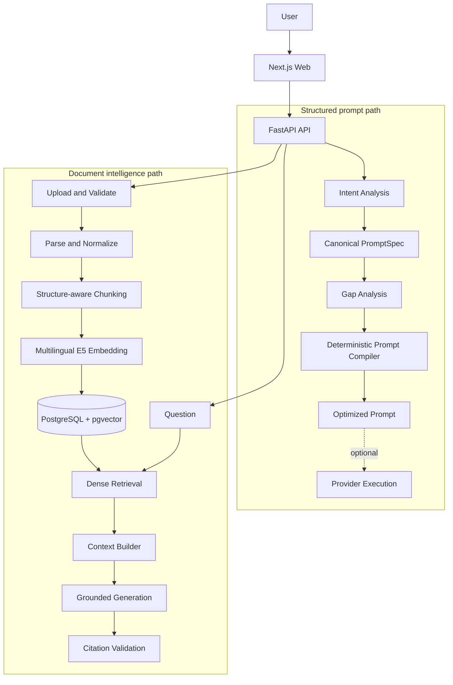

# Architecture

PromptForge keeps prompt construction and document intelligence as distinct
application paths behind the same FastAPI boundary.

The production retrieval configuration is
`StructureAwareChunker(350/500/40) → intfloat/multilingual-e5-large-instruct →
PostgreSQL + pgvector dense retrieval`. See the README for its measured M4
selection evidence and the final evaluation artifact for limitations.
